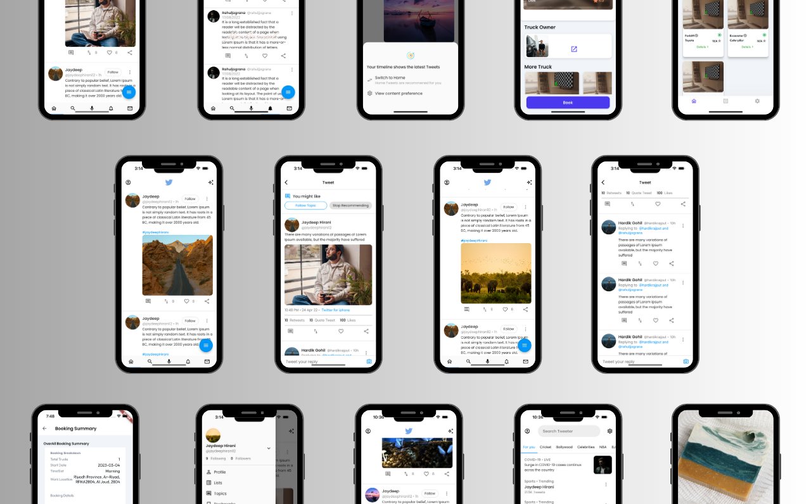
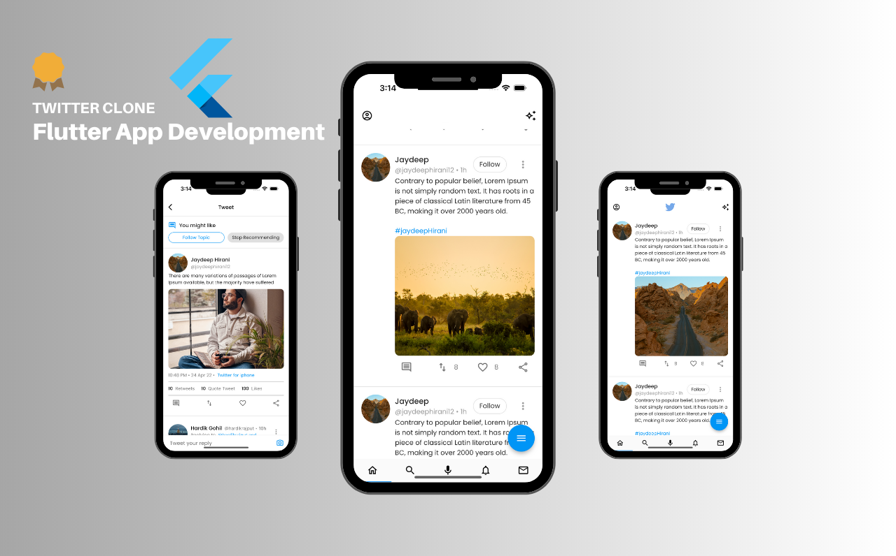

# Flutter-TwitterX Clone 

This is a Twitter Clone UI made with Flutter.

## [Try on Android](https://drive.google.com/file/d/10-a4VH-XOepbirG7_0VksYwz_zehzwO6/view?usp=sharing)

<!-- **Packages we are using:**

- flutter_svg: [link](https://pub.dev/packages/flutter_svg)

### Video Preview of Final UI

 -->

## Screens it contains:

* Onboarding

* Login

* Forgot Password

* Sign Up

* Home Page / Timeline

* Tweets

* Profile 

* Settings

* And Much More

 Thanks for your love and support 🙏 

## Photos

<!-- 

 -->
